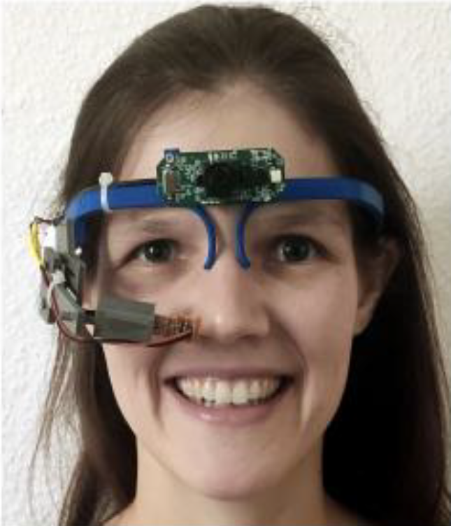

# Robust-Pupil-Detection-Algorithm

We presents a method for robust real-time pupil detection using computer vision techniques in OpenCV and Python. The technique focuses on reducing noise caused by eyelashes and other interferences, thus improving the accuracy and speed of detection. This approach is highly relevant for applications like gaze estimation, human-computer interaction, and advanced driver assistance.  
![Eye Camera with Non-Invasive Infrared Camera]

The methodology includes preprocessing steps like ROI selection, blurring, and Canny Edge Detection, followed by contour extraction and circular contour detection. The best circular contour is selected as the pupil candidate. The paper also discusses the dataset used, which consists of infrared camera footage, and presents the results showing the effectiveness of the method in terms of accuracy, precision, and processing speed.

This project was part of the course "Recent Advances in Machine Learning"
